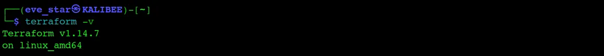
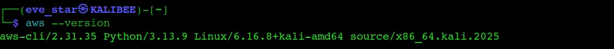
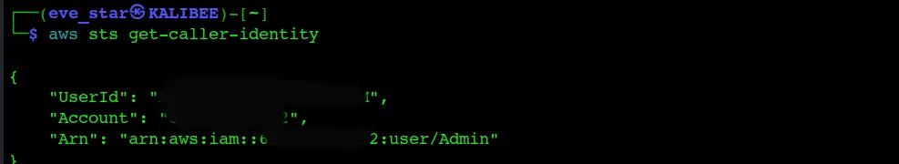
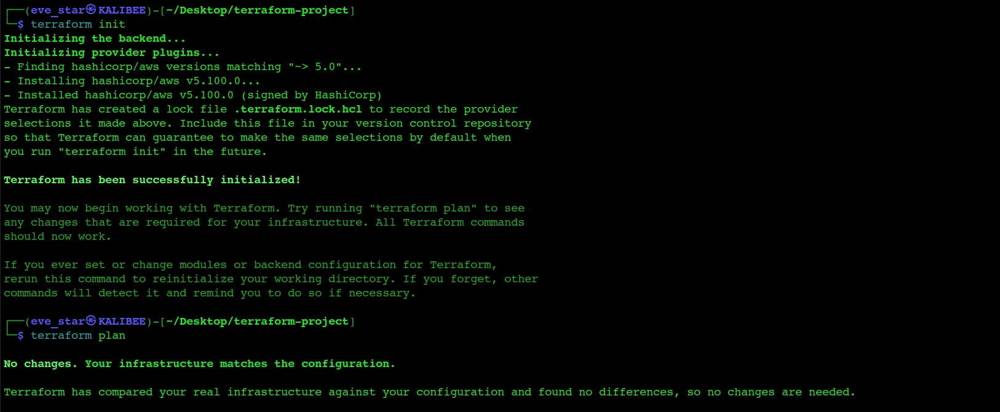

# Day 02 — Setting Up Terraform, AWS CLI, and Your AWS Environment

## Overview

Full environment setup day. Terraform installed, AWS CLI configured,
and the first Terraform project connected to AWS. Everything from
this point forward builds on this foundation.

---

## AWS Account Hardening

Before touching any tools, the AWS account needs to be locked down
properly. Root account misuse is one of the most common and
expensive mistakes in cloud work.

- Created an IAM user with admin privileges — the root account is
  left untouched after initial setup. Some root actions cannot be
  undone.
- Enabled MFA on the root account for an extra layer of security.
- Stored access and secret keys safely, never committed to Git.
  If you push keys to GitHub by accident, rotate them immediately.
- Set up billing alerts so AWS notifies you before spending crosses
  a threshold. No surprise invoices.

---

## Installing Terraform (Kali Linux)
```bash
# 1. Add HashiCorp's GPG key
wget -O- https://apt.releases.hashicorp.com/gpg | \
  sudo gpg --dearmor -o /usr/share/keyrings/hashicorp-archive-keyring.gpg

# 2. Add the HashiCorp repository
echo "deb [signed-by=/usr/share/keyrings/hashicorp-archive-keyring.gpg] \
  https://apt.releases.hashicorp.com $(lsb_release -cs) stable" | \
  sudo tee /etc/apt/sources.list.d/hashicorp.list

# 3. Update and install
sudo apt update && sudo apt install terraform -y

# 4. Confirm
terraform -version
```


---

## Installing AWS CLI
```bash
# 1. Download the installer
curl "https://awscli.amazonaws.com/awscli-exe-linux-x86_64.zip" \
  -o "awscliv2.zip"

# 2. Unzip
unzip awscliv2.zip

# 3. Install
sudo ./aws/install

# 4. Verify
aws --version
```



```bash
# 5. Configure with your IAM user credentials
aws configure
# Prompts for: Access Key ID, Secret Access Key, region, output format

# 6. Confirm configuration

```



**On choosing a region:** pick the region closest to you or your
users. Closer region = lower latency. `eu-west-1` (Ireland) is used
throughout this challenge.

---

## VS Code Setup

IDE of choice for this challenge: Visual Studio Code.

Two extensions to install immediately:
- **HashiCorp Terraform** — syntax highlighting, autocompletion,
  and formatting for `.tf` files
- **AWS Toolkit** — browse and interact with AWS resources directly
  from VS Code

---

## Connecting Terraform to AWS

With `aws configure` already run, Terraform picks up credentials
automatically from `~/.aws/credentials`. No extra auth needed in
the provider block.
```bash
# 1. Navigate to your project folder
cd ~/Desktop/terraform-30-day-challenge/day02-setup

# 2. Initialise Terraform — downloads the AWS provider plugin
terraform init
```


### What `terraform init` does

Running `terraform init` in a directory with a `main.tf` causes
Terraform to:
1. Read the `required_providers` block
2. Download the `hashicorp/aws` plugin from the Terraform registry
3. Create a `.terraform/` folder containing the plugin binary
4. Create a `.terraform.lock.hcl` file pinning the exact version

You should see:
```
Terraform has been successfully initialized!
```

---

## Files

### `main.tf`
```hcl
terraform {
  required_providers {
    aws = {
      source  = "hashicorp/aws"
      version = "~> 5.0"
    }
  }
}

provider "aws" {
  region = "eu-west-1"
}
```

**What each block does:**
- `terraform {}` — tells Terraform which plugins to download.
  Think of it like `package.json` for your infrastructure.
- `provider "aws" {}` — configures the downloaded plugin.
  Sets the region and picks up credentials from the environment
  automatically.

---

## Key Takeaways

- Never use the root account for day-to-day AWS work
- Terraform credentials come from `~/.aws/credentials` — you do
  not need to hardcode them in your `.tf` files
- `terraform init` must be run once in every new project folder
  before any other Terraform command
- The `.terraform/` folder and `.terraform.lock.hcl` are
  auto-generated — do not edit them manually
- Both are safe to commit to Git; the actual provider binary
  inside `.terraform/` is excluded by `.gitignore`

---


<sub>Tags: #30DayTerraformChallenge #TerraformSetup #AWS #DevOps #IaC*</sub>
