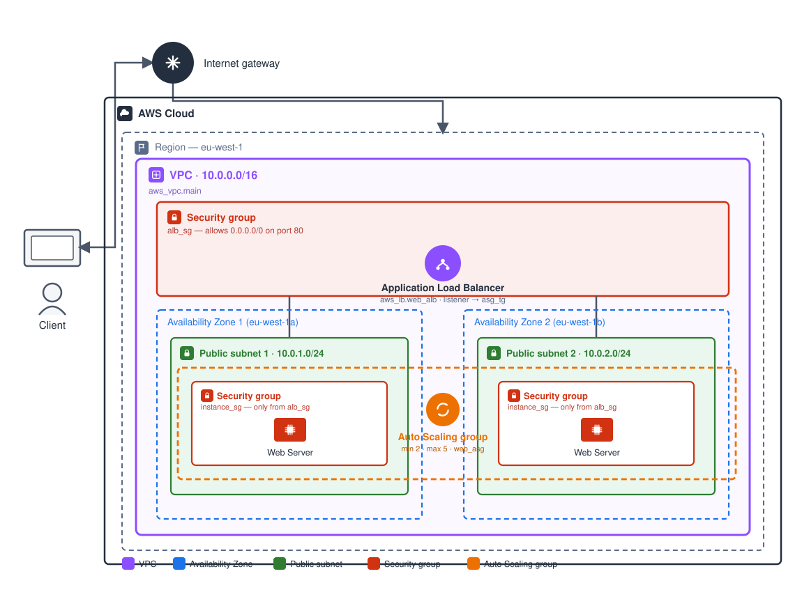

# Day 04 — Configurable & Clustered Web Server with Terraform

## Overview

Day 3 deployed one hardcoded EC2 instance. Day 4 does two things: refactor
that server so nothing is hardcoded (input variables), then rebuild it as a
cluster — an Auto Scaling Group behind an Application Load Balancer — so it
can survive an instance failure and handle real traffic.

## Files

```
Day-04/
├── configurable-server/
│   ├── main.tf         — provider, security group, EC2 instance, outputs (all variable-driven)
│   ├── variables.tf    — server_port, instance_type, ami_id, aws_region, vpc_cidr, public_subnet_cidr
│   └── vpc.tf          — VPC, public subnet, internet gateway, route table
├── clustered-server/
│   ├── main.tf         — security groups, launch template, ASG, ALB, target group, listener, output
│   ├── variables.tf    — server_port, alb_port, instance_type, min_size, max_size, ami_id, aws_region, vpc_cidr, public_subnet_cidrs
│   ├── data.tf         — aws_availability_zones (used to spread subnets across AZs)
│   └── vpc.tf          — VPC, 2 public subnets (one per AZ), internet gateway, route table
└── README.md           — this file / learning journal
```

## Architecture



Client traffic hits the internet gateway, enters the VPC, and lands on the
ALB's security group (`alb_sg`), the only thing in this setup allowed to
accept traffic from `0.0.0.0/0`. The ALB forwards to whichever instance the
target group currently reports as healthy. Each instance sits behind its own
security group (`instance_sg`), which only trusts traffic coming from
`alb_sg`, and the whole pair of instances is wrapped in the Auto Scaling
Group's boundary, which keeps the count between 2 and 5 no matter what
happens to any individual instance.

## How to Run

### Configurable server

```bash
cd Day-04/configurable-server
terraform init
terraform plan
terraform apply
```

Confirm before applying that `ami_id` is valid for your region (same check
as Day 3 — `aws ec2 describe-images ...`). Visit
`http://<public_ip>:<server_port>` (default port 8080) once applied.

```bash
terraform output
terraform destroy
```

### Clustered server

```bash
cd Day-04/clustered-server
terraform init
terraform plan
terraform apply
```

Wait 2–3 minutes for instances to pass health checks, then visit the
`alb_dns_name` output over plain HTTP (port 80). Confirm it returns the page,
capture the DNS name, then:

```bash
terraform destroy
```

---

## Learning Journal

### Configurable Web Server Code

See `configurable-server/main.tf` and `configurable-server/variables.tf`.

- `aws_region` — lets the same config target any AWS region without editing
  the provider block.
- `ami_id` — AMIs are region-specific; hardcoding one silently breaks the
  config the moment someone applies it in a different region.
- `instance_type` — defaults to `t2.micro` (free-tier eligible) but can be
  overridden for a bigger box without touching the resource block.
- `server_port` — defaults to `8080`; the security group ingress rule and the
  `httpd` `Listen` directive both read from this one variable, so the port
  the security group opens can never drift out of sync with the port the
  server actually listens on.
- `vpc_cidr` / `public_subnet_cidr` — this build creates its own VPC and
  subnet (`vpc.tf`) rather than relying on the account's default VPC, so the
  network the instance lives in is fully defined in code too.

### Clustered Web Server Code

See `clustered-server/main.tf`, `variables.tf`, `data.tf`, and `vpc.tf`.

- `aws_vpc.main` + `aws_subnet.public` (`vpc.tf`) — a dedicated VPC with one
  public subnet per AZ, instead of the account's default VPC. `count` spreads
  the subnets across `data.aws_availability_zones.all.names`, so the number
  of subnets always matches `public_subnet_cidrs`.
- `aws_internet_gateway.main` + `aws_route_table.public` — gives the subnets
  a route to the internet; without this the instances and ALB would have no
  way to reach or be reached from outside the VPC.
- `data.aws_availability_zones.all` — fetches AZs at plan time so the subnet
  count/placement adapts to whatever region you deploy into.
- `aws_launch_template.web_server` — the instance "recipe" (AMI, instance
  type, security group, user data) that the ASG stamps out on every launch.
- `aws_autoscaling_group.web_asg` — keeps between `min_size` (2) and
  `max_size` (5) instances running across the fetched AZs, replacing any
  instance that fails its health check.
- `aws_security_group.alb_sg` / `aws_security_group.instance_sg` — the ALB
  accepts HTTP from the internet; instances accept traffic only from the
  ALB's security group, not the open internet, which is a tighter blast
  radius than Day 3's instance-facing security group.
- `aws_lb.web_alb` + `aws_lb_target_group.asg_tg` + `aws_lb_listener.http` —
  the ALB listens on port 80, forwards to the target group, and the ASG
  registers/deregisters instances in that target group automatically as it
  scales.

### Deployment Confirmation

*(Fill in after you apply — this can't be verified without deploying to a
real AWS account.)*

- ALB DNS name: `___________________________`
- Confirmed page load: yes / no
- `terraform output`:
  ```
  paste output here
  ```

### DRY Principle in Practice

DRY means each piece of logic or configuration lives in exactly one place.
Before today, the AMI, instance type, and port were typed directly into
`main.tf` — three separate places a value could go stale. Pulling them into
`variables.tf` means the *logic* (what a web server looks like) is written
once, and the *values* (which AMI, which port, which environment) are
supplied separately. On a team, hardcoded values mean every engineer editing
`main.tf` risks silently changing production settings, environments drift
apart because nobody's sure which copy is current, and a single region or
instance-type change requires hunting through every resource block instead
of changing one default.

### Difference Between Configurable and Clustered

Day 3 and the configurable server are architecturally identical — one EC2
instance, one security group. There is no redundancy: if that instance
crashes, dies, or the AZ it's in goes down, the site is offline until someone
manually intervenes. The clustered version puts an ALB in front of a pool of
instances managed by an ASG. The ALB only routes to instances that pass
health checks, the ASG replaces unhealthy instances automatically, and
instances span multiple availability zones, so a single instance or AZ
failure doesn't take the app down. This is the difference between a demo and
something that could survive real traffic.

### Lab Takeaways

The data block lab (`aws_availability_zones`) demonstrated that data sources
read existing infrastructure or provider metadata into a config without
Terraform managing it as a resource. It's a plan-time lookup, not something
Terraform creates or destroys. In the cluster, `data.aws_availability_zones.all.names`
is indexed by `count.index` in `vpc.tf` to place one subnet per AZ — so the
subnet-to-AZ mapping is computed instead of hardcoded, and the same config
works in any region without editing AZ names by hand.

### Challenges and Fixes

*(Fill in with whatever you actually hit — common ones for this exact setup
to watch for:)*

- If the ALB target group shows instances as `unhealthy`: check that the
  target group's `port` matches `server_port` and that `instance_sg` allows
  inbound traffic from `alb_sg` on that same port.
- If `terraform apply` fails creating the ASG with a subnet/AZ mismatch:
  make sure `vpc_zone_identifier` subnets actually belong to the AZs listed
  in `availability_zones` — in the default VPC these should already line up.
- If the ALB DNS name doesn't resolve or times out: confirm the listener is
  forwarding to the target group and the security group on the ALB allows
  inbound on port 80 from `0.0.0.0/0`.

### Blog Post

T